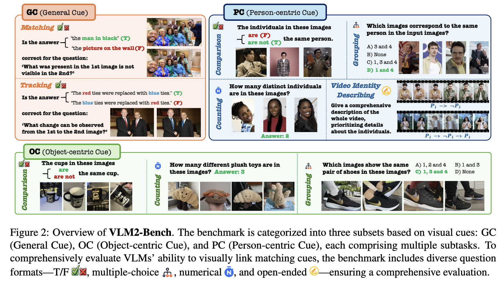
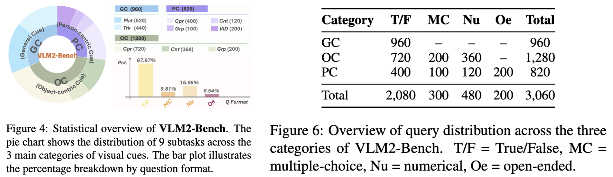

<div align="center">


# VLM2-Bench: A Closer Look at How Well VLMs Implicitly Link Explicit Matching Visual Cues

</div>

<div align="center">
<b><a href="https://sterzhang.github.io/" target="_blank">Jianshu Zhang</a><sup>1*</sup> <a href="https://rainjamesy.github.io/" target="_blank">Dongyu Yao</a><sup>2*</sup> <a href="https://scholar.google.com/citations?user=XUq0HwcAAAAJ&hl=en" target="_blank">Renjie Pi</a><sup>1</sup> <a href="https://pliang279.github.io/" target="_blank">Paul Pu Liang</a><sup>3</sup> <a href="https://mayrfung.github.io/" target="_blank">Yi R. (May) Fung</a><sup>1</sup></b>


<sup>1 </sup>HKUST &nbsp; <sup>2 </sup>CMU &nbsp; <sup>3 </sup>MIT

<sup>*</sup>: Equal contribution

[](https://vlm2-bench.github.io/)
[](https://arxiv.org/abs/2502.12084)
[](https://huggingface.co/datasets/Sterzhang/vlm2-bench)

[[**Leaderboard**📶]](https://paperswithcode.com/sota/visual-question-answering-vqa-on-vlm2-bench?metric=Average%20Score%20on%20VLM2-bench%20(9%20subtasks))

</div>

---

## Benchmark Introduction

VLM²-Bench is the first comprehensive benchmark that evaluates vision-language models' (VLMs) ability to visually link matching cues across multi-image sequences and videos. The benchmark consists of 9 subtasks with over 3,000 test cases, designed to assess fundamental visual linking capabilities that humans use daily, such as identifying the same person across different photos without prior knowledge of their identity. Through extensive evaluation of eight open-source VLMs and GPT-4o using various prompting techniques, we uncover significant challenges in visual cue linking abilities, with even the best model (GPT-4o) performing 34.80% below human level. Our analysis reveals the need for 1) stronger core visual capabilities with less reliance on prior knowledge, 2) better integration of language reasoning in visual tasks, and 3) improved training approaches for independent visual relationship inference.

---

## News

- **2025/03/12:** 🔧 We have integrated all 2860 multi-image cases of our VLM²-Bench into [VLMEvalKit](https://github.com/open-compass/VLMEvalKit/tree/main) (example usage [here](https://github.com/vlm2-bench/VLM2-Bench?tab=readme-ov-file#evaluation-with-vlmevalkit-on-all-2860-image-cases)). In the meantime, feel free to follow our repo for local deployment.
- **2025/02/24:** 🤗 We submit our paper to [HF daily paper (Feb 24)](https://huggingface.co/papers/2502.12084); your UPVOTES are greatly appreciated! 👍
- **2025/02/18:** 🚀 The preprint of VLM²-Bench is now officially released!

<!-- 
**2025/02/28:** ⚠️ In the initial version of our HF dataset, a folder was mistakenly uploaded within the .zip file. This issue has been corrected in the latest version. Please check the updated [HF dataset](https://huggingface.co/datasets/Sterzhang/vlm2-bench).

-**2025/02/25:** 🔧 We are actively working on integrating VLM²-Bench into lmms-eval and VLMEvalKit--stay tuned! In the meantime, feel free to follow our repo for local deployment. -->

---

## VLM²-Bench Overview

VLM²-Bench is designed to evaluate models' ability to visually link matching cues across multiple images and videos. It is organized into three main categories:

- **General Cue (GC):** Assessing matching and tracking of visual elements.
- **Object-centric Cue (OC):** Evaluating comparison, counting, and grouping of objects.
- **Person-centric Cue (PC):** Focusing on comparing, counting, grouping, and video identity describing of individuals.

The dataset comprises a total of 3060 question-answer pairs generated via a semi-automated pipeline with human verification, covering various question formats such as True/False, multiple-choice, numerical, and open-ended queries.

<div align="center">
<h4>VLM²-Bench Overview</h4>

</div>

<br>

<div align="center">
<h4>Dataset Statistics</h4>

</div>

---

## How to Evaluate Your Model on *VLM²-Bench*

### Step 0: Environment Setup

- **Git clone VLM²-Bench:**

```bash
git clone https://github.com/vlm2-bench/VLM2-Bench.git
cd VLM2-Bench
```

- **Create a conda environment with Python 3.9:**

```bash
conda create -n vlm2bench python=3.9
conda activate vlm2bench
pip install openai>=1
pip install -r requirements.txt
```

For model inference, our benchmark does not require any specific packages. We recommend using the official inference scripts provided by model developers. For example, to test Qwen2.5-VL-7B-Instruct, you can follow the installation and inference instructions at [Qwen2.5-VL-7B-Instruct](https://huggingface.co/Qwen/Qwen2.5-VL-7B-Instruct).

### Step 1: Download the Data

- Download the VLM²-Bench dataset from our [huggingface repository](https://huggingface.co/datasets/Sterzhang/vlm2-bench/resolve/main/vlm2-bench_dataset.zip) link and unzip it at the root directory of this repository:

```bash
unzip vlm2-bench_dataset.zip
```

after unzip, you will see the following structure:

```bash
vlm2-bench/
├── code
│   ├── gc
│   ├── oc
│   ├── pc
├── data (images and videos)
│   ├── gc
│   ├── oc
│   ├── pc
├── jsonl (question files)
│   ├── gc
│   │   └── vanilla
│   │       └── gc_mat.jsonl
│   │       └── gc_trk.jsonl
│   ├── oc
│   ├── pc
```

### Step 2: Run Model Inference

- We provide example inference code for Qwen2.5-VL-7B under each task's test_script_example directory, for example: [code/gc/test/test_script_example/test_qwen2p5_7B_img_qa_gc.py](code/gc/test/test_script_example/test_qwen2p5_7B_img_qa_gc.py).

example usage for single model on gc_mat task:

```bash
python code/gc/test/test_script_example/test_qwen2p5_7B_img_qa_gc.py \
--question_file "jsonl/gc/vanilla/gc_mat.jsonl" \
--image_folder "data/gc/processed" \
--output_dir "code/gc/test/test_res/test_mat"
```

- Additionally, under the test directory of each task, there is a complete bash script for sequential testing on multiple models, for example: [code/gc/test/run_gc_full_round.bash](code/gc/test/run_gc_full_round.bash).

Example commands:

```bash
bash code/gc/test/run_gc_full_round.bash
```

this script will run the model for gc_mat and gc_trk tasks, and save the results in the `code/gc/test/test_res` directory.

For more details, please refer to the `.bash` scripts for each task directly. You may easily navigate to these files following the **Roadmap** below.

#### *Roadmap* of inference scripts and bash scripts for all tasks in VLM²-Bench

example model: Qwen2.5-VL-7B-Instruct

- **GC**
  - inference script: [code/gc/test/test_script_example/test_qwen2p5_7B_img_qa_gc.py](code/gc/test/test_script_example/test_qwen2p5_7B_img_qa_gc.py)
  - bash script: [code/gc/test/run_gc_full_round.bash](code/gc/test/run_gc_full_round.bash)
- **OC**
  - inference script: [code/oc/test/test_script_example/test_qwen2p5_7B_img_qa_oc.py](code/oc/test/test_script_example/test_qwen2p5_7B_img_qa_oc.py)
  - bash script: [code/oc/test/run_oc_full_round.bash](code/oc/test/run_oc_full_round.bash)
- **PC-image**
  - inference script: [code/pc/image/test/test_script_example/test_qwen2p5_7B_img_qa_pc.py](code/pc/image/test/test_script_example/test_qwen2p5_7B_img_qa_pc.py)
  - bash script: [code/pc/image/test/run_pc-i_full_round.bash](code/pc/image/test/run_pc-i_full_round.bash)
- **PC-video** (open-ended)
  - inference script: [code/pc/video/test/test_script_example/test_qwen2p5_7B_vid_qa_pc-v.py](code/pc/video/test/test_script_example/test_qwen2p5_7B_vid_qa_pc-v.py)
  - bash script: [code/pc/video/test/run_pc-v_full_round.bash](code/pc/video/test/run_pc-v_full_round.bash)

### Step 3: Evaluate the Results

We provide separate evaluation scripts for each task as well as an all-in-one evaluation script (jupyter notebook) for evaluating all tasks.

- Navigate into the project directory, then run the evaluation script in `vlm2bench_evaluator.ipynb`. Remember to set the correct path to your result folder according to the instructions in the notebook.
- To evaluate the results of a single task, you can either run the script in the notebook or run the bash script in the `eval` directory of the task (for example, [code/gc/eval/eval_tf_batch_pair_3acc.py](code/gc/eval/eval_tf_batch_pair_3acc.py)).

---

## Evaluation with [VLMEvalKit](https://github.com/open-compass/VLMEvalKit) on all 2860 image cases

Please refer to the **[Quick Start](https://github.com/open-compass/VLMEvalKit/blob/main/docs/en/Quickstart.md)** tutorial of this toolkit for detailed instructions on setting up the environment and running the inference.

A simple inference example on our dataset (with name `VLM2Bench`) can be executed using:

```bash
python run.py \
--data VLM2Bench \
--model Qwen2.5-VL-7B-Instruct \
--work-dir /path/to/your/result/folder
```

---

## Experimental Results

The leaderboard is shown below:

<div align="center">

</div>

Our evaluation on 8 state-of-the-art open-source vision-language models and GPT-4o shows:

- **Significant Performance Gap:** Even the best-performing model (GPT-4o) is on average ~34.80% behind human performance.
- **Diverse Performance Patterns:** Models exhibit distinct strengths and weaknesses across various visual cue categories, indicating the need for specialized improvements.

---

## Citation

If you find this work useful, please cite our paper:

```bibtex
@misc{zhang2025vlm2benchcloserlookvlms,
      title={VLM2-Bench: A Closer Look at How Well VLMs Implicitly Link Explicit Matching Visual Cues}, 
      author={Jianshu Zhang and Dongyu Yao and Renjie Pi and Paul Pu Liang and Yi R. Fung},
      year={2025},
      eprint={2502.12084},
      archivePrefix={arXiv},
      primaryClass={cs.CL},
      url={https://arxiv.org/abs/2502.12084}, 
}
```

---

## Contact

Jianshu Zhang: jianshu.zhang777@gmail.com

Yi R. (May) Fung: yrfung@ust.hk

---

## License

**Code:** Licensed under the [Apache 2.0 License](LICENSE).
 **Dataset:** Licensed under the [CC BY-NC 4.0 License](https://creativecommons.org/licenses/by-nc/4.0/).
